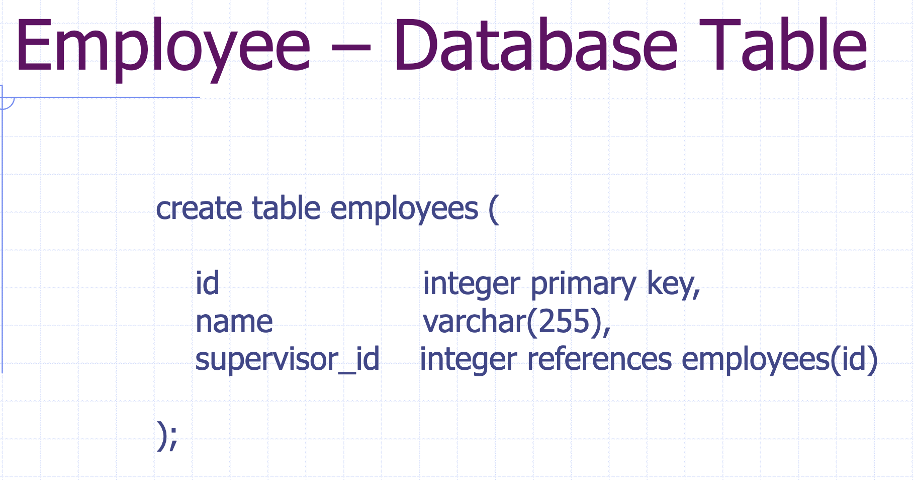

<h1>Object-Relational Mappimg </h1>

| 1  | 2 |
| ------------- | ------------- |
||

<h2>Data Model Calss</h2>
<h3>Persistent Class  </h3>
<ul>
A class whose objects need to be saved (i.e. persisted) in a database
<li> Any Java model class can be a persistent class, though it is recommendedthat </li>
  <li> Each persistent class has an identity field. </li>
  <li> Each persistent class implements the Serializableinterface</li>
  <li> Each persistent field has a pair of getterand setter, which don’t have to be public<li>
</ul>
