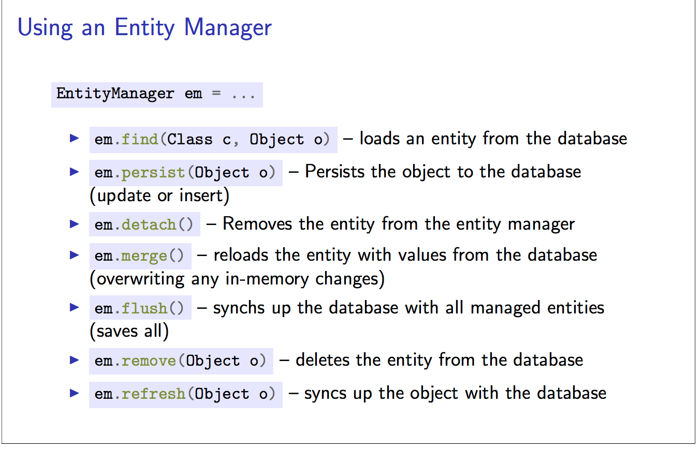

##Java ## Hibernate # Maven. # SpringBoot

---

* [JPA-Tutorial](https://github.com/RameshMF/JPA-Tutorial) |   [Java persistence with JPA](https://www.infoworld.com/article/3373652/java-persistence-with-jpa-and-hibernate-part-1-entities-and-relationships.html)
* [Interface EntityTransaction](https://www.objectdb.com/api/java/jpa/EntityTransaction).
* [Hibernate Query Language](https://www.tutorialspoint.com/hibernate/hibernate_query_language.htm).
* [JPA Mapping Annotations](https://www.javaguides.net/2018/11/all-jpa-annotations-mapping-annotations.html)
---
* .getSingleResult()
   * Execute a SELECT query that returns a single result.
*  `getResultList` executes the JPQL SELECT statement and returns the results as a List
* JPA  Operations that modify database content, such as a store, update, and delete should only be performed within an active transaction.
  	---
  - `entityManager.getTransaction().begin();` | `entityManager.getTransaction().commit();`| `entityManagerFactory.close();`
  ---
  A simple Persistent class should follow some rules
  ----
* A no-arg constructor: It is recommended that you have a default constructor at least package visibility so that hibernate can create the   instance of the Persistent class by newInstance() method.
* Provide an identifier property: It is better to assign an attribute as id. This attribute behaves as a primary key in a database.
* Declare getter and setter methods: The Hibernate recognizes the method by getter and setter method names by default.
* Prefer non-final class: Hibernate uses the concept of proxies, that depends on the persistent class. The application programmer will not be able to use proxies for lazy association fetching.

---
Common Errors
---
 * hibernate_sequence  does not exist. 
    * [error performing isolated work](https://coderanch.com/t/487173/databases/hibernate-sequence-exist).
 * PK mappmed to FK [@JoinColumn](https://stackoverflow.com/questions/11938253/whats-the-difference-between-joincolumn-and-mappedby-when-using-a-jpa-onetoma)
 * Use of @OneToMany or @ManyToMany targeting an unmapped class `You forgot the @Entity annotation on the ***** class.`
